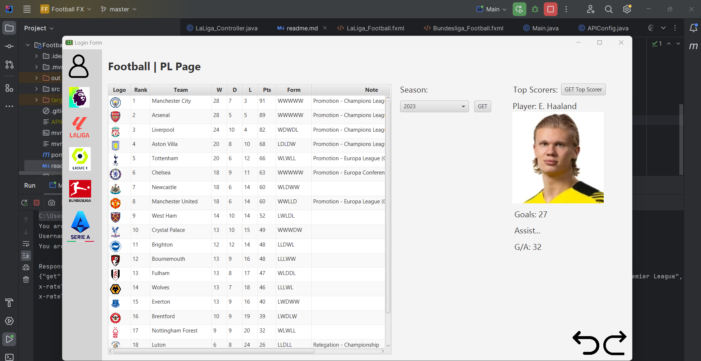
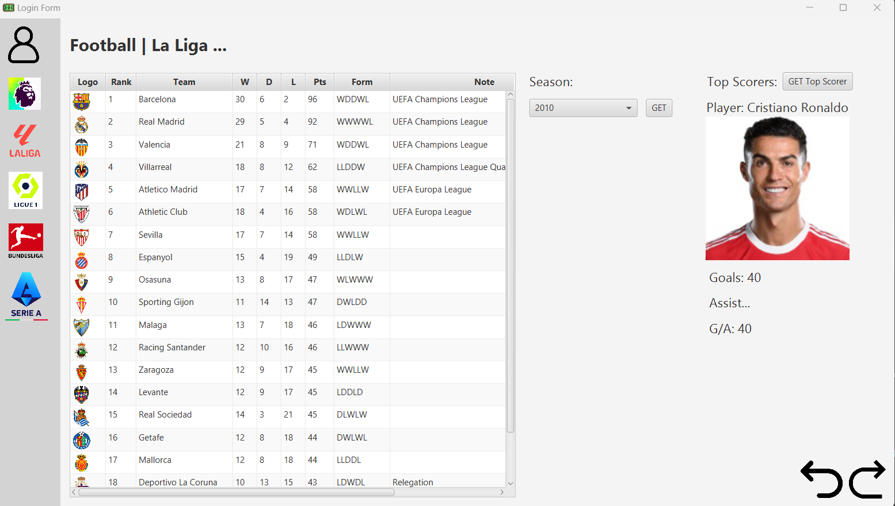
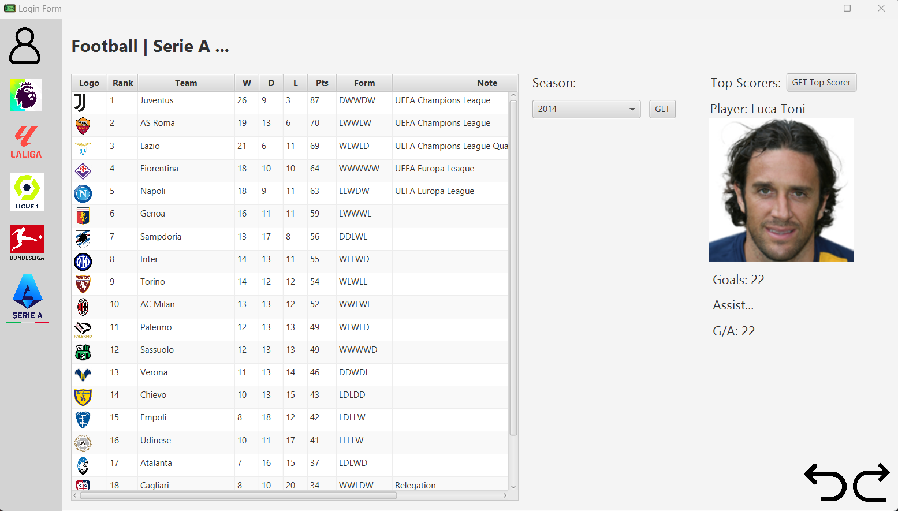

## Project: FootballFX Application
@Author: Mohammed Ahmed

**Code was inspired by @TapTap who made a currency converter using JavaFX framework and FXML.**

**From his walkthrough, I made a football application that displays [as of 17/5/24] the following**

- 5 Leagues
    - Premier League
    - La Liga
    - Ligue 1
    - Serie A
    - Bundesliga 
  
- Seasons: Current to 2010 (Requires yearly Increment to current season)

- Top Scorer: display the highest scorer incl goals & assists for selected {league} {season}

**Demo Images**

